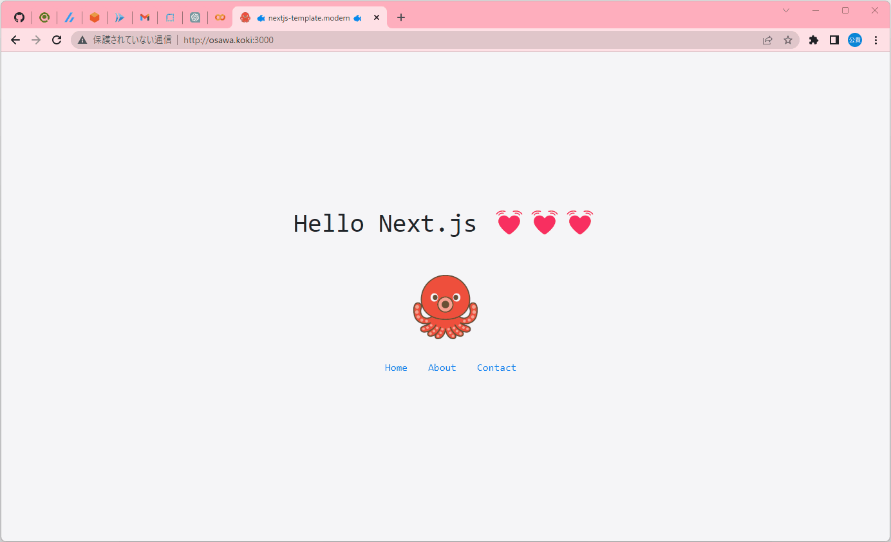

# nextjs-template.modern

🍔🍔🍔 少しモダンなNextjsのテンプレート。  

  

## 使い方

```shell
# モジュールのインストール
yarn

# デバグ実行
yarn dev

# ビルド
yarn build
# -> ./distディレクトリにファイル一式が出力されます。
```

## ディレクトリ構成

原則としてNextjsに従います。  

独自に`setting.ts`ファイルに設定を記述しています。  
これは、TypeScriptによる型を付すためです。  

また、`pages.ts`にはページ一覧を書いています。  
これは`pages`ディレクトリにあるファイルと一致させる必要があります。  
`pages`ディレクトリを探索せずに、`pages.ts`でページを指定する理由は、アクティブページなどの指定ができるようにするためと、ページの並び順が指定できるようにするためです。  

---

それ以外はNextjsの公式と同じです。  

`components`ディレクトリはページを表示する際の部品を管理し、`pages`はページを、`styles`はスタイルシートを管理します。  

## Dockerでのビルド

Dockerを使用する場合には以下のコマンドを実行します。  

```shell
docker build -t nextjs-template-modern .
docker run -v ★カレントディレクトリ★dist:/app/dist -it --rm --name my-nextjs-template-modern nextjs-template-modern
```

distディレクトリまでの絶対パスを指定します。  
UNIXライクなシステムでは`$(pwd)`を使用すればOKです。  
`$(pwd)/dist`といった感じです。  

Windowsでは`%cd%`で行けるはずですが、シェルシステムとバージョンによってはできないことがあります。  
その場合には絶対パスをそのまま指定して下さい。  
